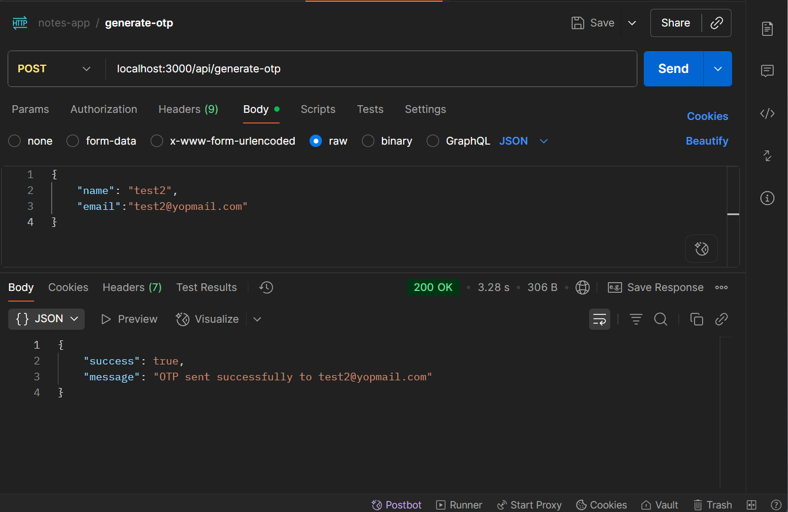
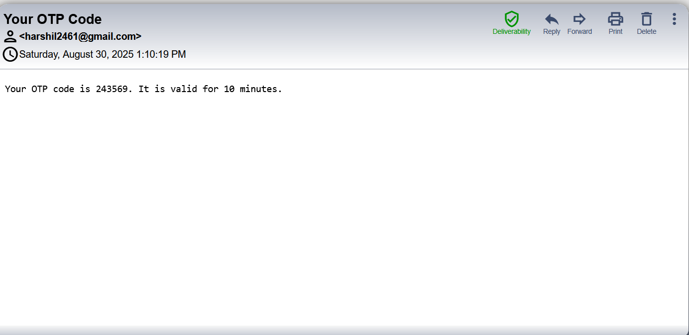
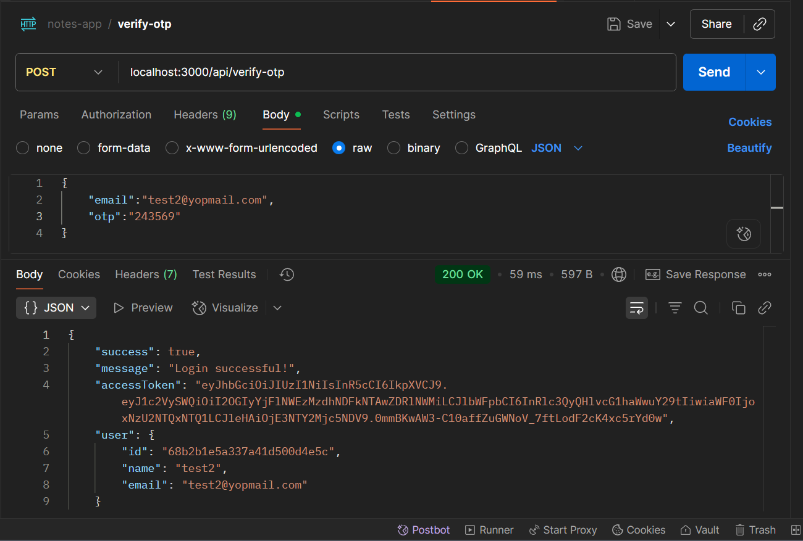
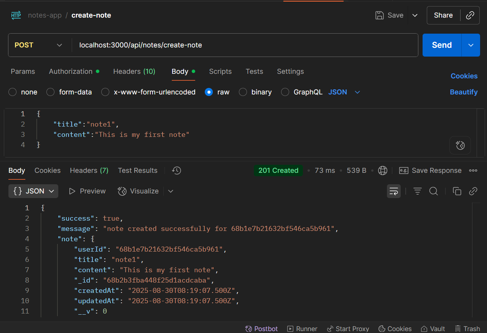
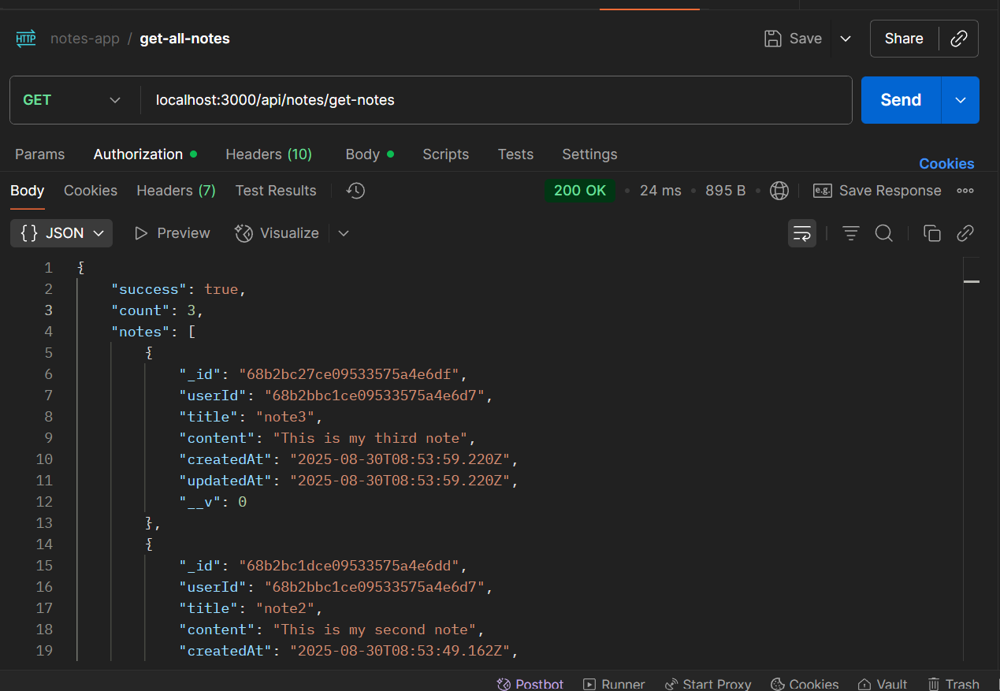
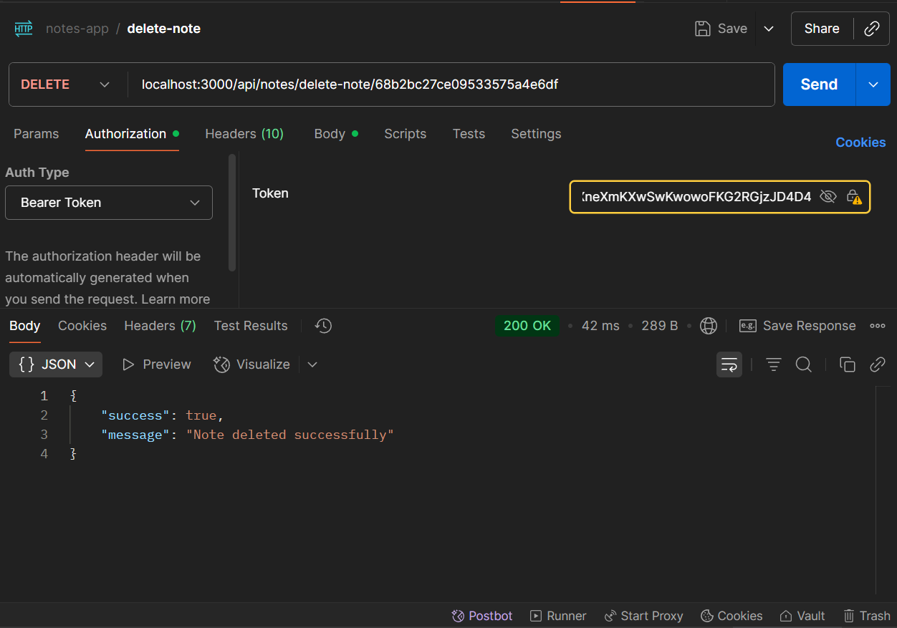

# Notes App API

A simple notes application backend built with Node.js and Express.  
Supports user authentication via OTP and CRUD operations for notes.

## Features

- User registration and login via OTP
- Create, read, and delete notes
- JWT-based authentication
- API documentation with Swagger

## Technologies

- Node.js
- Express
- MongoDB
- Swagger (OpenAPI)

## Getting Started

### Prerequisites

- Node.js & npm
- MongoDB (local or Atlas)

### Installation

```bash
git clone https://github.com/yourusername/notes-app.git
cd notes-app
npm install
```

### Environment Variables

Create a `.env` file in the `server` directory:

```
PORT=3000
MONGODB_URI=your_mongodb_connection_string
JWT_SECRET=your_jwt_secret
```

### Running Locally

```bash
npm start
```

The server will run at `http://localhost:3000`.

### API Documentation

Swagger UI is available at:

```
http://localhost:3000/api-docs
```

If deployed, visit:

```
https://your-app.onrender.com/api-docs
```

## API Endpoints

### Auth

- `POST /api/generate-otp` – Generate OTP for login


- `POST /api/verify-otp` – Verify OTP and login

### Notes

- `POST /api/notes/create-note` – Create a new note

- `GET /api/notes/get-notes` – Get all notes for user

- `DELETE /api/notes/delete-note/:id` – Delete a note by ID


## Deployment

You can deploy this project on [Render](https://render.com/) or any Node.js hosting platform.

## License

MIT
